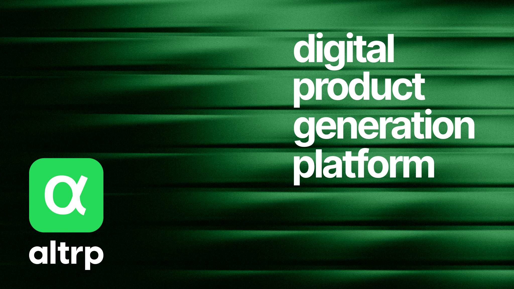

# Next.js & Git-CMS: Modern Content Platform



<p align="center">
  <a href="#-about-the-project">About The Project</a> •
  <a href="#-key-features">Key Features</a> •
  <a href="#️-tech-stack">Tech Stack</a> •
  <a href="#-project-structure">Project Structure</a> •
  <a href="#-getting-started">Getting Started</a>
</p>

<p align="center">
  
  
  
  
</p>

## ✨ About The Project

**Altrp** is a modern, type-safe, and high-performance monorepo for building web applications. It consists of 4 main projects:

- **📱 site** - Static website (Next.js 15, React 19, Tailwind CSS 4)
- **🎛️ cms** - Admin panel with MDX support
- **🤖 bot** - AI agents and Telegram bots with SQLite
- **🗄️ app** - Payload Backend with PostgreSQL

The project is built with a strong focus on **Developer Experience (DX)** and scalability, leveraging the best tools from the modern web ecosystem.

## 🚀 Key Features

*   **⚡️ Blazing Fast Performance**: Powered by Bun and Next.js App Router with Server Components.
*   **📂 Git-Powered CMS**: All content is version-controlled in the repository and easily editable.
*   **✍️ Built-in Editor**: Edit MDX content directly in the browser with a Tiptap-based editor.
*   **🛡️ End-to-end Type Safety**: TypeScript throughout, with schema validation for content and forms via Zod.
*   **🌐 Internationalization (i18n) Ready**: Built-in support for multiple languages with `next-intl`.
*   **🎨 Flexible UI Customization**: Components built with shadcn/ui and styled with Tailwind CSS 4.
*   **🔎 Lightning-Fast Search**: Client-side content search powered by Fuse.js.
*   **📈 SEO Optimized**: Automatic sitemap generation, RSS feeds, and metadata management with `next-seo`.
*   **🛠️ Superior Developer Experience**: Linting, formatting, Git hooks, and code generation out-of-the-box.

## 🛠️ Tech Stack

This project uses a carefully curated set of technologies to achieve maximum efficiency and a great developer experience.

### Core & Architecture

| Technology | Purpose |
| :--- | :--- |
| **Bun** | An incredibly fast JavaScript runtime, bundler, and package manager. |
| **Next.js** | The React Framework with App Router for hybrid and server rendering. |
| **TypeScript** | Strict typing for code reliability and scalability. |
| **Tailwind CSS 4** | A utility-first CSS framework for rapid and consistent styling. |
| **Git-as-CMS** | The strategy of using Git as a version-controlled content database. |
| **Repository Pattern** | A design pattern to abstract data access logic from the application. |
| **Zustand** | A minimalistic and powerful state management solution. |

### UI & Frontend

| Technology | Purpose |
| :--- | :--- |
| **Shadcn/ui** | Not a library, but a collection of reusable, customizable components. |
| **Lucide React** | Beautiful and consistent open-source icons. |
| **next-themes** | Theme management (light/dark mode) integrated with Next.js. |
| **Tremor** | Components for building insightful dashboards in the CMS. |
| **Sonner** | An elegant and simple toast notification library. |

### Data & Content

| Technology | Purpose |
| :--- | :--- |
| **MDX** | A content format that lets you use React components in Markdown. |
| **next-mdx-remote**| A powerful tool for rendering MDX strings. |
| **Zod** | Schema validation for MDX frontmatter and form data. |
| **Fuse.js** | A lightweight fuzzy-search library for client-side search. |
| **TipTap** | A headless editor framework for creating custom WYSIWYG experiences. |

### Tooling & DX

| Technology | Purpose |
| :--- | :--- |
| **React Hook Form** | Performant and flexible form management. |
| **Husky + lint-staged**| Automatically run linters and tests before each commit. |
| **ESLint + Prettier** | Enforcing consistent code style and catching errors. |


## 📁 Project Structure

This is a **monorepo** with 4 main applications:

```
altrp/
├── apps/
│   ├── site/             # Static website (port 3100)
│   ├── cms/              # Admin panel (port 3101)
│   ├── bot/              # AI bots (port 3102)
│   └── app/              # Payload CMS (port 3103)
├── packages/
│   ├── components/       # Shared UI components
│   ├── lib/              # Shared utilities
│   └── types/            # Shared TypeScript types
└── settings.ts           # Global configuration
```

### Available Commands

| Command | Description |
|---------|-------------|
| `bun run dev` | Run all projects |
| `bun run dev:site` | Run site only |
| `bun run dev:cms` | Run CMS only |
| `bun run dev:bot` | Run bot only |
| `bun run dev:app` | Run app only |
| `bun run build:site` | Build site for production |
| `bun run build:cms` | Build CMS for production |

## 🚀 Getting Started

Follow these steps to get the project running locally.

### 1. Create Repository
```bash
# Create a new repository on GitHub
# Name: <YOUR_PROJECT>
```

### 2. Clone the repository
```bash
# Open Cursor and terminal
git clone https://github.com/GTFB/altrp <YOUR_PROJECT>
cd <YOUR_PROJECT>
```

### 3. Change remote origin
```bash
# Change origin to your repository
git remote set-url origin https://github.com/<YOUR_ORG>/<YOUR_PROJECT>
git push -u origin main
```

### 4. Setup Cloudflare Pages
1. Open [Cloudflare Dashboard](https://dash.cloudflare.com)
2. Go to **Pages** → **Create a project**
3. Connect GitHub and select `<YOUR_PROJECT>`
4. Configure build settings:
   - **Build command**: `bun run build:site`
   - **Build output**: `apps/site/dist`
   - **Root directory**: `apps/site`
   - **Build comments**: `Enabled`

### 5. Install dependencies

This project uses **Bun**. If you don't have it installed, please [install it first](https://bun.sh/docs/installation).

```bash
bun install
```

### 6. Configure ports (if needed)
```bash
# If this is not your first project, change port in apps/site/package.json
# Change 3100 to 3101, 3102, etc.
```

### 7. Run the Development Server

```bash
# Run site only
cd apps/site
bun run dev

# Or run all projects
bun run dev
```

Open [http://localhost:3100](http://localhost:3100) in your browser.

### 8. Development Workflow
- Open site in hot reload mode: `http://localhost:3100`
- All changes are visible in real time
- Edit components in `apps/site/components/`

### 9. Test changes
```bash
# Stop server
taskkill /F /IM node.exe

# Restart
bun run dev
```

### 10. Deploy changes
```bash
# Add changes
git add .

# Create commit
git commit -m "feat: added new features"

# Push changes
git push origin main

# Watch deployment in Cloudflare Pages
# Check changes on production

### Available Scripts

*   `bun dev`: Runs the app in development mode.
*   `bun build`: Builds the app for production.
*   `bun start`: Starts the production server.
*   `bun lint`: Lints the codebase with ESLint.
*   `bun format`: Formats the code with Prettier.
*   `bun test`: Runs unit tests.

### Available Commands

#### Development Commands

| Command | Make | NPM/Bun | Description |
|---------|------|---------|-------------|
| Run site dev server | `make dev-site` | `bun run dev:site` | Start the site application in development mode |
| Run CMS dev server | `make dev-cms` | `bun run dev:cms` | Start the CMS application in development mode |
| Run app dev server | `make dev-app` | `bun run dev:app` | Start the app application in development mode |
| Run all apps concurrently | `make dev-all` | `bun run dev` | Start all applications simultaneously in development mode |

#### Production Commands

| Command | Make | NPM/Bun | Description |
|---------|------|---------|-------------|
| Build site | `make build-site` | `bun run build:site` | Build the site application for production |
| Build CMS | `make build-cms` | `bun run build:cms` | Build the CMS application for production |
| Build app | `make build-app` | `bun run build:app` | Build the app application for production |
| Build all apps | `make build-all` | `bun run build` | Build all applications for production |
| Start site | `make start-site` | `bun run start:site` | Start the site application in production mode |
| Start CMS | `make start-cms` | `bun run start:cms` | Start the CMS application in production mode |
| Start app | `make start-app` | `bun run start:app` | Start the app application in production mode |

#### Testing Commands

| Command | Make | NPM/Bun | Description |
|---------|------|---------|-------------|
| Quick E2E tests | `make quick-test` | `bun run quick-test` | Run quick end-to-end tests for CMS public pages |

#### Project Setup Commands

| Command | Make | NPM/Bun | Description |
|---------|------|---------|-------------|
| Install dependencies | `make install` | `bun install` | Install all project dependencies |
| Initialize project | `make init` | - | Initialize all project configurations (ESLint, Prettier, Husky, etc.) |
| Generate .env file | `make env` | - | Generate .env file from example.env with auto-generated NEXTAUTH_SECRET |
| Generate component | `make component NAME=ComponentName` | `bun hygen component new --name ComponentName` | Generate a new React component using Hygen |

#### Code Quality Commands

| Command | Make | NPM/Bun | Description |
|---------|------|---------|-------------|
| Run linter | `make lint` | `bun run lint` | Run ESLint to check code quality |
| Format code | `make format` | `bun run format` | Format code using Prettier |
| Run tests | `make test` | `bun test` | Run unit tests with Bun |

## 🔐 Access & Permissions

### Getting Admin Access

To access the admin panel and manage content:

1. **Authentication Setup**: Configure your authentication provider in `.env.local`
2. **Admin Role**: Currently, admin access is hardcoded for testing (see `AdminGuard.tsx`)
3. **Access Admin Panel**: Navigate to `/admin` after authentication

### API Endpoints

The project provides several API endpoints for content management:

#### Content Management
- `GET /api/admin/blog` - Get all blog posts with pagination
- `POST /api/admin/blog` - Create a new blog post
- `PUT /api/admin/blog/[slug]` - Update a blog post
- `DELETE /api/admin/blog/[slug]` - Delete a blog post

#### Authors & Categories
- `GET /api/authors` - Get all authors
- `GET /api/categories` - Get all categories

#### Public Content
- `GET /api/posts` - Get published posts
- `GET /api/rss` - RSS feed for blog posts

### Content Creation

#### Creating New Components
Use the built-in code generator to create new React components:

```bash
bun hygen component new --name ComponentName
```

#### Adding New Content
1. **Blog Posts**: Add MDX files to `content/blog/[slug]/index.mdx`
2. **Pages**: Add MDX files to `content/pages/[slug].mdx`
3. **Authors**: Add MDX files to `content/authors/[slug].mdx`
4. **Categories**: Add MDX files to `content/categories/[slug].mdx`

### Development Workflow

1. **Start Development**: `bun dev`
2. **Access Admin**: Go to `http://localhost:3000/admin`
3. **Create Content**: Use the admin interface or add MDX files directly
4. **Preview Changes**: Content updates automatically in development mode

---

## 🤝 Contributing

Contributions are welcome! Please see `CONTRIBUTING.md` for more details on how to get started.

## 📄 License

This project is licensed under the MIT License. See the [LICENSE](LICENSE) file for details.